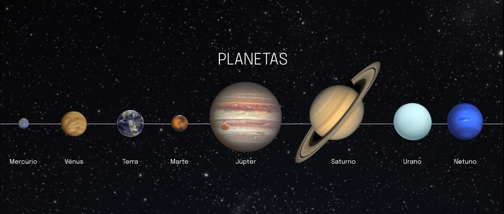

# Boas-vindas ao repositório do projeto Solar System!

Para realizar o projeto, atente-se a cada passo descrito a seguir, e se tiver qualquer dúvida, nos envie por _Slack_! #vqv 🚀

Aqui você vai encontrar os detalhes de como estruturar o desenvolvimento do seu projeto a partir deste repositório, utilizando uma branch específica e um _Pull Request_ para colocar seus códigos.

# Termos e acordos

Ao iniciar este projeto, você concorda com as diretrizes do Código de Conduta e do Manual da Pessoa Estudante da Trybe.

# Entregáveis

<details>
  <summary><strong>🤷🏽‍♀️ Como entregar</strong></summary><br />

  Para entregar o seu projeto você deverá criar um *Pull Request* neste repositório.

  Lembre-se que você pode consultar nosso conteúdo sobre [Git & GitHub](https://app.betrybe.com/course/4d67f5b4-34a6-489f-a205-b6c7dc50fc16/) e nosso [Blog - Git & GitHub](https://blog.betrybe.com/tecnologia/git-e-github/) sempre que precisar!
</details>

<details>
  <summary><strong>👨‍💻 O que deverá ser desenvolvido</strong></summary><br />

  Neste projeto você desenvolverá um modelo do sistema solar! Ao utilizar essa aplicação, uma pessoa usuária deverá ser capaz de:

    * Visualizar todos os planetas do sistema solar renderizados na tela;

    * Visualizar todas as cartas com informações sobre missões espaciais;

</details>

<details>
  <summary><strong>:memo: Habilidades</strong></summary><br />

  Neste projeto, verificaremos se você é capaz de:

  * Utilizar JSX no React;

  * Utilizar corretamente o método `render()` para renderizar seus componentes;

  * Utilizar `import` para trazer componentes em diferentes arquivos;

  * Criar componentes de classe em React;

  * Criar múltiplos componentes a partir de um array;

  * Fazer uso de `props` corretamente;

  * Fazer uso de `PropTypes` para validar as `props de um componente`.
</details>

<details>
  <summary><strong>🗓 Data de Entrega</strong></summary><br />
  
  * Este projeto é individual;
  * Serão `1` dias de projeto;
  * Data para entrega final do projeto: `08/03/2023 14:00`.

</details>

# Orientações

<details>
  <summary><strong>‼️ Antes de começar a desenvolver</strong></summary><br />

  1. Clone o repositório

  - Use o comando: `git clone git@github.com:tryber/sd-029-b-project-solar-system.git`.
  - Entre na pasta do repositório que você acabou de clonar:
    - `cd sd-029-b-project-solar-system`

  2. Instale as dependências

  - `npm install`.
  
  3. Crie uma branch a partir da branch `master`

  - Verifique que você está na branch `master`
    - Exemplo: `git branch`
  - Se não estiver, mude para a branch `master`
    - Exemplo: `git checkout master`
  - Agora crie uma branch à qual você vai submeter os `commits` do seu projeto
    - Você deve criar uma branch no seguinte formato: `nome-de-usuario-nome-do-projeto`
    - Exemplo: `git checkout -b joaozinho-sd-029-b-project-solar-system>`

  4. Adicione as mudanças ao _stage_ do Git e faça um `commit`

  - Verifique que as mudanças ainda não estão no _stage_
    - Exemplo: `git status` (deve aparecer listada a pasta _joaozinho_ em vermelho)
  - Adicione o novo arquivo ao _stage_ do Git
    - Exemplo:
      - `git add .` (adicionando todas as mudanças - _que estavam em vermelho_ - ao stage do Git)
      - `git status` (deve aparecer listado o arquivo _joaozinho/README.md_ em verde)
  - Faça o `commit` inicial
    - Exemplo:
      - `git commit -m 'iniciando o projeto x'` (fazendo o primeiro commit)
      - `git status` (deve aparecer uma mensagem tipo _nothing to commit_ )

  5. Adicione a sua branch com o novo `commit` ao repositório remoto

  - Usando o exemplo anterior: `git push -u origin joaozinho-sd-029-b-project-solar-system`

  6. Crie um novo `Pull Request` _(PR)_

  - Vá até a página de _Pull Requests_ do [repositório no GitHub](https://github.com/tryber/sd-029-b-project-solar-system/pulls)
  - Clique no botão verde _"New pull request"_
  - Clique na caixa de seleção _"Compare"_ e escolha a sua branch **com atenção**
  - Coloque um título para a sua _Pull Request_
    - Exemplo: _"Cria tela de busca"_
  - Clique no botão verde _"Create pull request"_
  - Adicione uma descrição para o _Pull Request_ e clique no botão verde _"Create pull request"_
  - **Não se preocupe em preencher mais nada por enquanto!**
  - Volte até a [página de _Pull Requests_ do repositório](https://github.com/tryber/sd-029-b-project-solar-system/pulls) e confira que o seu _Pull Request_ está criado

</details>

<details>
  <summary><strong>⌨️ Durante o desenvolvimento</strong></summary><br />

  - Faça `commits` das alterações que você fizer no código regularmente

  - Lembre-se de sempre após um (ou alguns) `commits` atualizar o repositório remoto

  - Os comandos que você utilizará com mais frequência são:
    1. `git status` _(para verificar o que está em vermelho - fora do stage - e o que está em verde - no stage)_
    2. `git add` _(para adicionar arquivos ao stage do Git)_
    3. `git commit` _(para criar um commit com os arquivos que estão no stage do Git)_
    4. `git push -u origin nome-da-branch` _(para enviar o commit para o repositório remoto na primeira vez que fizer o `push` de uma nova branch)_
    5. `git push` _(para enviar o commit para o repositório remoto após o passo anterior)_

</details>

<details>
  <summary><strong>🤝 Depois de terminar o desenvolvimento (opcional)</strong></summary><br />

  Para sinalizar que o seu projeto está pronto para o _"Code Review"_, faça o seguinte:

  - Vá até a página **DO SEU** _Pull Request_, adicione a label de _"code-review"_ e marque seus colegas:

    - No menu à direita, clique no _link_ **"Labels"** e escolha a _label_ **code-review**;

    - No menu à direita, clique no _link_ **"Assignees"** e escolha **o seu usuário**;

    - No menu à direita, clique no _link_ **"Reviewers"** e digite `students`, selecione o time `tryber/students-sd-029-b`.

  Caso tenha alguma dúvida, [aqui tem um video explicativo](https://vimeo.com/362189205).

</details>

<details>
  <summary><strong>🕵🏿 Revisando um pull request</strong></summary><br />

  Use o conteúdo sobre [Code Review](https://course.betrybe.com/real-life-engineer/code-review/) para te ajudar a revisar os _Pull Requests_.

</details>

<details>
  <summary><strong>🎛 Linter</strong></summary><br />

  Usaremos o [ESLint](https://eslint.org/) e o [StyleLint](https://stylelint.io/) para fazer a análise estática do seu código.

  Este projeto já vem com as dependências relacionadas ao _linter_ configuradas no arquivo `package.json`.

  Para poder rodar o _linter_ em um projeto basta executar o comando `npm install` dentro do projeto e depois `npm run lint` para executar o `ESLint`, ou `npm run lint:styles` para executar o `StyleLint`. Se a análise do _linter_ encontrar problemas no seu código, tais problemas serão mostrados no seu terminal. Se não houver problema no seu código, nada será impresso no seu terminal.

  Você pode também instalar o plugin do `ESLint` no `VSCode`. Para isso, basta fazer o download do [plugin `ESLint`](https://marketplace.visualstudio.com/items?itemName=dbaeumer.vscode-eslint) e instalá-lo.

  Em caso de dúvidas, confira o material do course sobre [ESLint e Stylelint](https://app.betrybe.com/course/real-life-engineer/eslint).

  ⚠️ Lembre-se que o seu projeto só será avaliado se estiver passando pelos **checks** dos **linters**.
</details>

<details>
  <summary><strong>🛠 Testes</strong></summary><br />

  Vamos utilizar [React Testing Library](https://testing-library.com/docs/react-testing-library/intro) para execução dos testes.

  ### Executando todos os testes

  Esse _framework_ de testes utiliza algumas marcações no código para verificar a solução proposta, uma dessas marcações é o atributo `data-testid` e faremos uso dele aqui.

  Na descrição dos requisitos do projeto será pedido que seja feita a adição de atributos `data-testid` nos elementos _HTML_. Veja o exemplo abaixo para deixar mais nítido como usar esse requisito:

  Se o requisito pedir "crie um botão e adicione o id de teste (ou `data-testid`) com o valor `my-action`, você pode criar:

  ```html
  <button data-testid="my-action"></button>
  ```

  ou

  ```html
  <a data-testid="my-action"></a>
  ```

  Ou seja, o atributo `data-testid="my-action"` servirá para o _React Testing Library_(RTL) identificar o elemento. Dessa forma, conseguiremos realizar testes focados no comportamento da aplicação.

  Em alguns requisitos, utilizamos o `getByRole` para poder selecionar os elementos de forma semântica. Portanto, atente-se às instruções de cada requisito. Por exemplo, se o requisito pedir explicitamente um `button`, você deverá utilizar exatamente esse elemento.

  Para verificar a solução proposta, você pode executar todos os testes localmente, basta executar:

  ```bash
  npm test
  ```

  ### Dica: desativando testes

  Especialmente no início, quando a maioria dos testes está falhando, a saída após executar os testes é extensa. Você pode desabilitar temporariamente um teste utilizando a função `.skip` junto à função `it`. Como o nome indica, esta função "pula" um teste:

  ```javascript
  it.skip('Será validado se o componente `<Title />` contém uma tag `h2`', () => {
    render(<Title headline={headlineText} />);
    const headline = screen.getByRole('heading', { level: 2 });
      
    expect(headline).toBeInTheDocument();
  });
  ```

  

  Uma outra forma para contornar esse problema é a utilização da função `.only` após o `it`. Com isso, será possível que apenas um requisito rode localmente e seja avaliado.

  ```javascript
  it.only('Será validado se o componente `<Title />` contém uma tag `h2`', () => {
    render(<Title headline={headlineText} />);
    const headline = screen.getByRole('heading', { level: 2 });
      
    expect(headline).toBeInTheDocument();
  });
  ```

  

  ### Executando um teste específico

  Você também pode rodar apenas um arquivo de teste, por exemplo:

  ```bash
  npm test 03.Title.test.js
  ```

  ou

  ```bash
  npm test 03.Title
  ```

  ⚠️ **O avaliador automático não necessariamente avalia seu projeto na ordem em que os requisitos aparecem no readme. Isso acontece para deixar o processo de avaliação mais rápido. Então, não se assuste se isso acontecer, ok?**

</details>

<details>
  <summary><strong>:convenience_store: Desenvolvimento </strong></summary><br />

  Você deve desenvolver uma aplicação em React com criação de componentes de classe e passagem de props. Essa aplicação simulará uma visualização do Sistema Solar, bem como informações sobre diversas missões espacias que ocorreram ao longo da história.

  As imagens dos planetas e as informações das missões são fornecidas no projeto. Você terá que desenvolver os componentes necessários para exibí-las na tela, conforme o descrito nos requisitos.
</details>

<details>
  <summary><strong>🗣 Nos dê feedbacks sobre o projeto!</strong></summary><br />

Ao finalizar e submeter o projeto, não se esqueça de avaliar sua experiência preenchendo o formulário. 
**Leva menos de 3 minutos!**

[FORMULÁRIO DE AVALIAÇÃO DE PROJETO](https://be-trybe.typeform.com/to/ZTeR4IbH#cohort_hidden=CH29-B&template=betrybe/sd-029-b-project-solar-system)

</details>

<details>
  <summary><strong>💻 Protótipo do projeto no Figma</strong></summary><br />

  Além da qualidade do código e do atendimento aos requisitos, um bom layout é um dos aspectos responsáveis por melhorar a usabilidade de uma aplicação e turbinar seu portfólio!

  Você pode estar se perguntando: *"Como deixo meu projeto com um layout mais atrativo?"* 🤔

  Para isso, disponibilizamos esse [protótipo do Figma](https://www.figma.com/file/V0ShpXzvv8OEi0DlDnXsJq/%5BProjeto%5D%5BFrontend%5D-Solar-System?node-id=2%3A2) para lhe ajudar !

  ⚠️ A estilização de sua aplicação não será avaliada nesse projeto, portanto esse protótipo é apenas uma **sugestão** e seu uso é **opcional**. Sinta-se à vontade para modificar o layout e deixá-lo do seu jeito.

  Caso queira utilizar a mesma imagem de fundo apresentada no Figma, ela está sendo disponibilizada dentro da pasta `src/images`.

</details>

<details>
  <summary><strong>🗂 Compartilhe seu portfólio!</strong></summary><br />

  Você sabia que o LinkedIn é a principal rede social profissional e compartilhar o seu aprendizado lá é muito importante para quem deseja construir uma carreira de sucesso? Compartilhe esse projeto no seu LinkedIn, marque o perfil da Trybe (@trybe) e mostre para a sua rede toda a sua evolução.

</details>

# Requisitos

:warning: **PULL REQUESTS COM ISSUES DE LINTER NÃO SERÃO AVALIADAS.** :warning:

:warning: **As imagens são meramente ilustrativas para visualizar o fluxo da aplicação, os nomes devem seguir os requisitos e não as imagens.** :warning:

## 1. Crie um componente chamado `Header`

<details>
  <summary>Crie um componente chamado <code>Header</code> dentro da pasta <code>src/components</code>. Este componente irá renderizar o título principal da página.</summary>

  - Ele deve conter uma tag `header` e, dentro dela, uma tag `h1`. O texto da tag `h1` deve ser "Sistema Solar";
    
  - Renderize o componente `Header` dentro do componente principal `App`.

  
</details>

<details>
  <summary><strong>O que será verificado</strong></summary><br />

  * Será validado se o componente `<Header />` é renderizado;

  * Será validado se o componente `<Header />` contém uma tag `header`;

  * Será validado se o componente `<Header />` contém uma tag `h1`;

  * Será validado se o componente `<Header />` renderiza corretamente o texto "Sistema Solar";

  * Será validado se o componente `<Header />` está sendo renderizado no componente principal `App`.
</details>

---

## 2. Crie um componente chamado `SolarSystem`

<details>
  <summary>Crie um componente chamado <code>SolarSystem</code> dentro da pasta <code>src/components</code>.</summary>

  - O componente `SolarSystem` deve ter uma `div` que envolva todo seu conteúdo e que tenha o atributo `data-testid="solar-system"`;

  - Renderize o componente `SolarSystem` abaixo do `Header`, dentro do componente principal `App`.
</details>

<details>
  <summary><strong>O que será verificado</strong></summary><br />

  * Será validado se o componente `<SolarSystem />` é renderizado;

  * Será validado se existe uma `div` que possui o `data-testid="solar-system"`;

  * Será validado se o componente `<SolarSystem />` está sendo renderizado no componente principal `App`.
</details>

---

## 3. Crie um componente chamado `Title`

<details>
  <summary>Crie um componente chamado <code>Title</code> dentro da pasta <code>src/components</code>.</summary>

  - O componente `Title` deve receber uma prop `headline`;
    
  - Ele deve conter uma tag `h2`, que deve renderizar o texto recebido pela prop `headline`.
</details>

<details>
  <summary><strong>O que será verificado</strong></summary><br />

  * Será validado se o componente `<Title />` é renderizado;

  * Será validado se o componente `<Title />` contém uma tag `h2`;

  * Será validado se o componente `<Title />` renderiza o texto passado pela prop `headline` dentro de uma tag `h2`.
</details>

---

## 4. Renderize o componente `Title` dentro do componente `SolarSystem`

<details>
  <summary>Renderize o componente <code>Title</code> dentro do componente <code>SolarSystem</code>.</summary>

  - O componente `Title` deve ser renderizado recebendo a prop `headline` com o valor "Planetas".

  
</details>

<details>
  <summary><strong>O que será verificado</strong></summary><br />

  * Será validado se o texto "Planetas" é renderizado usando o componente `Title` dentro do componente `SolarSystem`.
</details>

---

## 5. Crie um componente chamado `PlanetCard`
<details>
  <summary>Crie um componente chamado <code>PlanetCard</code> dentro da pasta <code>src/components</code>.</summary>

  - O componente `PlanetCard` deve receber duas props: uma chamada `planetName` e outra chamada `planetImage`;
    
  - O componente `PlanetCard` deve ter uma `div` que envolva todo seu conteúdo e que tenha o atributo `data-testid="planet-card"`;
    
  - O componente `PlanetCard` deve renderizar o texto recebido pela prop `planetName`. Sugerimos a utilização de tags de [Conteúdo de Fluxo](https://developer.mozilla.org/pt-BR/docs/Web/Guide/HTML/Content_categories#conte%C3%BAdo_de_fluxo), como `<p>`, que deve conter o atributo `data-testid="planet-name"`;
    
  - O componente `PlanetCard` deve renderizar uma imagem que tenha o atributo `src` com o valor recebido pela prop `planetImage`;

  - Além do atributo `src`, a imagem renderizada deve ter o atributo `alt` com o texto `Planeta {planetName}`, onde `{planetName}` é o valor recebido pela prop `planetName`.
</details>

<details>
  <summary><strong>O que será verificado</strong></summary><br />

  * Será validado se o componente `<PlanetCard />` é renderizado;

  * Será validado se o componente `<PlanetCard />` possui uma div com o atributo `data-testid="planet-card"`;

  * Será validado se é renderizado o texto recebido pela prop `planetName`;

  * Será validado se é renderizada uma imagem com o atributo `src` com o mesmo valor recebido pela prop `planetImage`;

  * Será validado se, além do atributo `src`, a imagem renderizada possui o atributo `alt` com o texto `Planeta {planetName}`, onde `{planetName}` é o valor recebido pela prop `planetName`.
</details>

---

## 6. Renderize uma lista com os planetas do Sistema Solar

<details>
  <summary>Renderize uma lista com os planetas do Sistema Solar dentro do componente <code>SolarSystem</code>.</summary>

  - Utilize o componente `PlanetCard` para renderizar cada item da lista de planetas;

  - Você encontrará a lista com os nomes e as imagens de cada planeta do Sistema Solar no arquivo `src/data/planets.js`;
    
  - Você deve importar a lista no componente `SolarSystem` usando o código:
  ```javascript
  import planets from '../data/planets';
  ```

  - A lista de planetas é um _array_ de objetos no seguinte formato:
  ```javascript
  {
    name: "Nome do planeta",
    image: "caminho-para-imagem-do-planeta"
  }
  ```

  - Para cada planeta da lista, você deverá renderizar um componente `PlanetCard`, passando o atributo `name` para a prop `planetName` e o atributo `image` para a prop `planetImage`.

  
</details>

<details>
  <summary>:bulb: Dica: </summary> 

  - Lembre-se do método que te permite criar vários componentes iguais a partir dos valores presentes em um _array_. Lembre-se que ao renderizar uma lista, você deve passar o atributo `key` para cada item. Você pode usar o nome do planeta como `key`.
</details>

<details>
  <summary><strong>O que será verificado</strong></summary><br />

  * Será verificado se é renderizado um componente `<PlanetCard />` para cada planeta da lista de planetas;

  * Será verificado se todos os planetas do Sistema Solar estão sendo listados na tela.
</details>

---

## 7. Crie um componente chamado `Missions`.

<details>
  <summary>Crie um componente chamado <code>Missions</code> dentro da pasta <code>src/components</code>.</summary>

  - Este componente deve ter uma `div` que envolva todo seu conteúdo e que tenha o atributo `data-testid="missions"`;

  - Renderize o componente `Missions` abaixo do `SolarSystem`, dentro do componente principal `App`.
</details>

<details>
<summary><strong>O que será verificado</strong></summary><br />

  * Será validado se o componente `<Missions />` é renderizado;

  * Será validado se existe uma `div` que possui o `data-testid="missions"`;

  * Será validado se o componente `<Missions />` está sendo renderizado no componente principal `App`.
</details>

---

## 8. Renderize o componente `Title` dentro do componente `Missions`.

<details>
  <summary>Renderize o componente <code>Title</code> dentro do componente <code>Missions</code>.</summary>

  - O componente `Title` deve ser renderizado recebendo a prop `headline` com o valor "Missões".

  
</details>
<details>
<summary><strong>O que será verificado</strong></summary><br />

  * Será validado se o texto "Missões" é renderizado usando o componente `Title` dentro do componente `Missions`.
</details>

---

## 9. Crie um componente chamado `MissionCard`.

<details>
  <summary>Crie um componente chamado <code>MissionCard</code> dentro da pasta <code>src/components</code>.</summary>

  - O componente `MissionCard` deve receber quatro props:
    - `name`
    - `year`
    - `country`
    - `destination`

  - O componente `MissionCard` deve ter uma `div` que envolva todo seu conteúdo e que tenha o atributo `data-testid="mission-card"`;
  
  - O componente `MissionCard` deve renderizar o texto recebido pela prop `name`. Sugerimos a utilização de tags de [Conteúdo de Fluxo](https://developer.mozilla.org/pt-BR/docs/Web/Guide/HTML/Content_categories#conte%C3%BAdo_de_fluxo), como `<p>`, que deve conter o atributo `data-testid="mission-name"`;
  
  - O componente `MissionCard` deve renderizar o texto recebido pela prop `year`. Sugerimos a utilização de tags de [Conteúdo de Fluxo](https://developer.mozilla.org/pt-BR/docs/Web/Guide/HTML/Content_categories#conte%C3%BAdo_de_fluxo), como `<p>`, que deve conter o atributo `data-testid="mission-year"`;
  
  - O componente `MissionCard` deve renderizar o texto recebido pela prop `country`. Sugerimos a utilização de tags de [Conteúdo de Fluxo](https://developer.mozilla.org/pt-BR/docs/Web/Guide/HTML/Content_categories#conte%C3%BAdo_de_fluxo), como `<p>`, que deve conter o atributo `data-testid="mission-country"`;
  
  - O componente `MissionCard` deve renderizar o texto recebido pela prop `destination`. Sugerimos a utilização de tags de [Conteúdo de Fluxo](https://developer.mozilla.org/pt-BR/docs/Web/Guide/HTML/Content_categories#conte%C3%BAdo_de_fluxo), como `<p>`, que deve conter o atributo `data-testid="mission-destination"`.
</details>

<details>
  <summary><strong>O que será verificado</strong></summary><br />

  * Será validado se o componente `<MissionCard />` é renderizado;

  * Será validado se o componente `<MissionCard />` possui uma div com o atributo `data-testid="mission-card"`;

  * Será validado se é renderizado o texto recebido pela prop `name`;

  * Será validado se é renderizado o texto recebido pela prop `year`;

  * Será validado se é renderizado o texto recebido pela prop `country`;

  * Será validado se é renderizado o texto recebido pela prop `destination`. 
</details>

---

## 10. Renderize uma lista com as missões espaciais

<details>
  <summary>Renderize uma lista com as missões espaciais dentro do componente <code>Missions</code>.</summary>

  - Utilize o componente `MissionCard` para renderizar cada item da lista de missões;

  - Você encontrará a lista com as informações de cada missão espacial no arquivo `src/data/missions.js`;

  - Você deve importar a lista no componente `Missions` usando o código:
  ```javascript
  import missions from '../data/missions';
  ```

  - A lista de missões espaciais é um _array_ de objetos no seguinte formato:
  ```javascript
  {
    name: 'Nome da missão',
    year: 'Ano de lançamento da missão',
    country: 'País que lançou a missão',
    destination: 'Destino da missão',
  }
  ```

  - Para cada missão espacial da lista, você deverá renderizar um componente `MissionCard`, passando cada atributo para sua respectiva prop.

  

</details>
<details>
<summary>:bulb: Dica:</summary>

  - Lembre-se do método que te permite criar vários componentes iguais a partir dos valores presentes em um _array_. Lembre-se que ao renderizar uma lista, você deve passar o atributo `key` para cada item. Você pode usar o nome da missão como `key`.
</details>

<details>
  <summary><strong>O que será verificado</strong></summary><br />

  * Será verificado se é renderizado um componente `<MissionCard />` para cada missão espacial da lista de missões;

  * Será verificado se todas as missões espaciais estão sendo listadas na tela.
</details>

---
